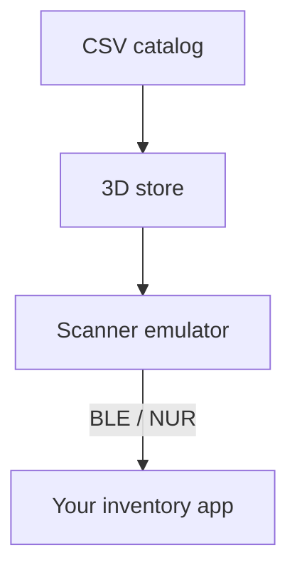

# RFID Store Simulator

Walk a virtual store and scan its shelves to test RFID inventory software
without a physical scanner or tagged products.

<p align="center">
  
</p>

[Watch the full walkthrough (MP4, 34 s)](https://github.com/dees91/rfid-store-simulator/releases/download/v0.1.0/3d-store-demo.mp4)

[Quick start](#quick-start) | [How it works](#how-it-works) | [Connect your app](#connect-your-app) | [Documentation](#documentation--support)

RFID Store Simulator pairs a browser-based 3D store with a Python scanner
emulator compatible with Nordic ID EXA51 / EXA81 devices over Bluetooth Low
Energy (BLE). It is for developers and testers of RFID inventory apps.

- **Explore and scan:** walk the aisles, aim at shelves, and see scan progress.
- **Use your catalog:** generate shelves and RFID tags from a CSV product list.
- **Test your app:** connect it to the emulator to receive tag reads, barcode
  reads, and scanner trigger events.

## Quick start

Try the 3D store with synthetic products. This demo needs no Bluetooth
hardware, Android emulator, or inventory app.

**Requirements:** Git, Python 3.10+, and a desktop browser. The commands below
use a macOS/Linux shell. macOS is validated; Linux and Windows are untested.
The project is **alpha (0.x)**; see the [changelog](CHANGELOG.md) for changes.

### 1. Install

```bash
git clone https://github.com/dees91/rfid-store-simulator.git
cd rfid-store-simulator
python3 -m venv .venv
.venv/bin/python -m pip install -e .
```

Already use `uv` or conda? See [install alternatives](docs/usage.md#install-alternatives).

### 2. Start the virtual controller

In **terminal 1**, from the repository directory:

```bash
.venv/bin/python scripts/media/virtual_controller.py --port 9100 --peer
```

Leave it running. Wait for the log message containing `listening on`.

### 3. Open the store

Open **terminal 2** in the same repository directory, then generate the demo
catalog and start the store:

```bash
.venv/bin/python scripts/media/make_demo_catalog.py /tmp/rfid-store-demo.csv
.venv/bin/scanner-emu-3d \
  --transport tcp-client:127.0.0.1:9100 \
  --catalog /tmp/rfid-store-demo.csv \
  --standalone-inventory
```

Open the URL printed by the second command in your browser. Once the panel
shows `1 peer`, the demo is ready to scan.

### 4. Scan a shelf

1. Click inside the store. Move with **WASD** or the arrow keys and look
   around with the mouse.
2. Walk close to a shelf, aim at the products, and press **Space** to scan.
   You can also use the **Start Scan** button.
3. Watch the scanned count rise: red products are unscanned, amber are
   partially scanned, and green are complete.

Press **Space** again to stop scanning and **Esc** to release the mouse.
To close the demo, press **Ctrl+C** in terminal 2, then terminal 1.
The generated CSV stays in `/tmp/rfid-store-demo.csv`; you can delete it afterward.

This demo uses a simulated Bluetooth peer. To receive scans in your own
app, follow [Connect your app](#connect-your-app).

## How it works

A CSV catalog supplies products and quantities. The simulator creates a
store and a unique RFID tag for each unit. As you aim and scan in the
browser, the Python backend selects tags from nearby shelves.

With an app connected, those reads follow this path:



The browser acts as the scanner's controls. In a connected-app session,
**Start Scan** sends a trigger event; your app starts inventory and receives
the tag reads. In the demo, `--standalone-inventory` lets the browser start
inventory itself.

The command-line REPL uses the same backend, `scanner-emu`, for tests that
need no browser. See [REPL commands](docs/usage.md#repl-commands).

## Connect your app

Your app must support the NUR scanner protocol over BLE. Choose the setup
that matches where it runs:

| Your app runs on | Transport | Setup |
| --- | --- | --- |
| An Android emulator | `android-netsim` | [Android emulator guide](docs/usage.md#android-emulator) |
| A physical device | `usb:0` | [USB Bluetooth dongle setup](docs/usage.md#physical-device) |

The physical-device path was validated on macOS with an ASUS USB-BT500
dongle. The Mac's built-in Bluetooth controller cannot be used for this.

Connect through your app's scanner search to **EXA51-EMU** (or **EXA81-EMU**
with `--model exa81`). Use a CSV catalog whose products exist in your app's
active dataset. The [operator guide](docs/usage.md) covers launch commands,
catalog format, and connection troubleshooting.

Compatibility covers scanner discovery and details, antenna and power
settings, RFID inventory, barcode reads, and trigger events. Only a subset
of NUR is implemented; see [supported commands](docs/nur-protocol.md#supported-commands).

## Documentation & support

- [Operator guide](docs/usage.md): Bluetooth setup, CSV catalogs, 3D options,
  REPL commands, and JSON configuration.
- [Troubleshooting](docs/emulator.md#common-failure-modes) and
  [known limitations](docs/emulator.md#known-differences-vs-real-hardware).
- [Documentation index](docs/README.md): protocol notes, architecture, and
  design decisions.
- [Issues](https://github.com/dees91/rfid-store-simulator/issues) for bugs and
  compatibility reports; [security policy](SECURITY.md) for private reporting.
- [Contributing](CONTRIBUTING.md) for development setup, repository layout,
  and checks. During `0.x`, minor releases may change public interfaces;
  breaking changes are recorded in the [changelog](CHANGELOG.md).

## License & notices

[MIT License](LICENSE). See [third-party notices](NOTICE.md) for dependency
licenses, firmware distribution, and synthetic data information.

The simulator reads your CSV locally and keeps store and scanner session
state in memory. The browser UI binds to `127.0.0.1` by default. Realtek
firmware is downloaded separately during USB dongle setup; it is not bundled.

Nordic ID, EXA, and NUR are trademarks of their respective owners. This
project is an independent, unofficial emulator and is not affiliated with or
endorsed by Nordic ID.
