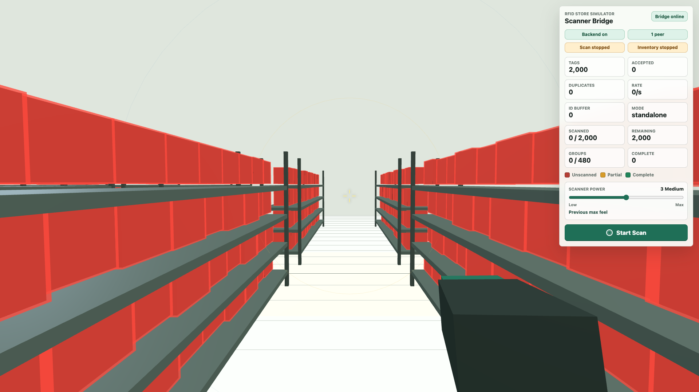
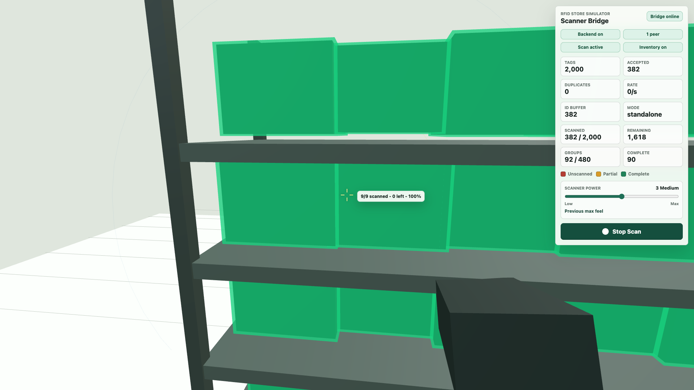
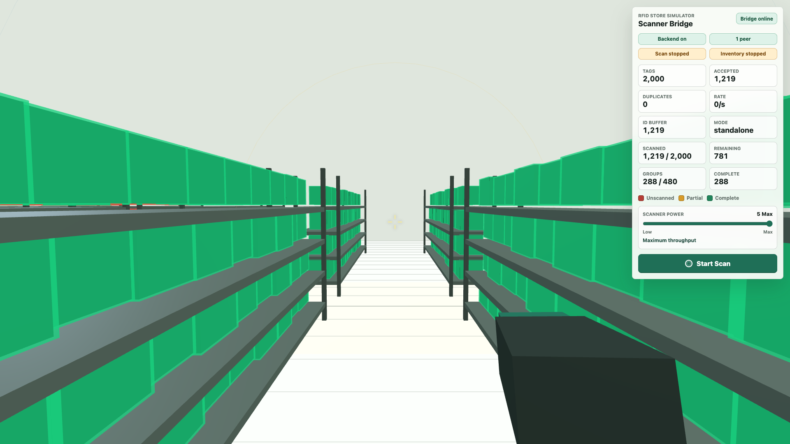

# Operator guide

Set up RFID Store Simulator for your app, supply a product catalog, or drive
it from the command line. For a first run with sample data and no Bluetooth
hardware, follow the [README quick start](../README.md#quick-start).

- [Install alternatives](#install-alternatives)
- [Android emulator](#android-emulator)
- [Physical device](#physical-device)
- [3D store simulator and CSV catalogs](#3d-store-simulator)
- [How the hardware-free demo works](#how-the-hardware-free-demo-works)
- [REPL commands](#repl-commands)
- [Config file](#config-file)
- [Troubleshooting](#troubleshooting)

Run all commands from the repository root. Examples use a virtual environment
at `.venv`; replace `path/to/catalog.csv` with your CSV product catalog.

## Install alternatives

The [standard installation](../README.md#1-install) uses Python 3.10+,
`venv`, and `pip`. The BLE stack is
[Bumble](https://github.com/google/bumble), installed from PyPI.

If you already use `uv`:

```bash
uv venv --python 3.13 .venv
uv pip install --python .venv/bin/python -e .
```

A conda environment works with `pip install -e .`; use Python 3.10+ and
drop the `.venv/bin/` prefix from subsequent commands.

## Connect your app

Your app must support the NUR scanner protocol over Bluetooth Low Energy
(BLE). The emulator advertises as `EXA51-EMU` by default. It supports scanner
search and connection, scanner details, antenna mask and TX level, RFID
inventory streaming, barcode reads, and trigger events. See the
[supported NUR commands](./nur-protocol.md#supported-commands) for the exact
compatibility subset.

The `--transport` option selects the connection to a Bluetooth controller.
It is passed to [Bumble](https://google.github.io/bumble/transports/index.html);
the two operational paths documented here are `android-netsim` and `usb:0`.
The hardware-free demo uses a separate virtual controller over TCP.

### Android emulator

With your Android emulator running, start the store:

```bash
.venv/bin/scanner-emu-3d --transport android-netsim --model exa51 \
  --catalog path/to/catalog.csv
```

Open the printed URL in a desktop browser and use your app's scanner search
to connect to `EXA51-EMU`. Then follow [Scan with a connected app](#scan-with-a-connected-app).
Your app is responsible for starting and stopping inventory in response to
the scan trigger. Omit `--standalone-inventory` for this integration flow.

To use the same backend from the REPL:

```bash
.venv/bin/scanner-emu run --transport android-netsim --model exa51
```

Use your app's product catalog for integration tests: generated tag values
must match products in the app's active dataset to appear in its inventory.
The demo catalog contains synthetic products.

## Physical device

Validated on macOS on Apple Silicon with an **ASUS USB-BT500** dongle
(Realtek RTL8761BU, USB ID `0b05:190e`). A Mac's built-in Bluetooth is not
usable by Bumble, hence the dongle. Bumble's Realtek driver loads the
firmware into the dongle the first time it is used after being plugged in.

### One-time setup

1. Tell macOS never to take over an external USB Bluetooth controller, then
   unplug and re-plug the dongle:

   ```bash
   sudo nvram bluetoothHostControllerSwitchBehavior="never"
   ```

2. Download the Realtek firmware into the directory Bumble searches. On
   macOS that is `~/Library/Application Support/com.google.bumble/firmware/realtek`.
   If `BUMBLE_RTK_FIRMWARE_DIR` is set, Bumble looks only there; otherwise
   it checks that directory and then the current directory. The files are
   pinned to the linux-firmware `20260810` release and verified by checksum:

   ```bash
   FW_DIR="$HOME/Library/Application Support/com.google.bumble/firmware/realtek"
   mkdir -p "$FW_DIR"
   BASE="https://git.kernel.org/pub/scm/linux/kernel/git/firmware/linux-firmware.git/plain/rtl_bt"
   TAG=20260810
   curl -fsSL -o "$FW_DIR/rtl8761bu_fw.bin" "$BASE/rtl8761bu_fw.bin?h=$TAG"
   curl -fsSL -o "$FW_DIR/rtl8761bu_config.bin" "$BASE/rtl8761bu_config.bin?h=$TAG"
   cd "$FW_DIR" && shasum -a 256 -c <<'SUMS' && cd -
   1d7a9597349ad89344fa16c1913d3e39e9a12e966e417ca16871bc79bbe59edb  rtl8761bu_fw.bin
   6c28a3f07c6a30ed208c4b64862a23f02b7d93543ea980edd24df16bab45095f  rtl8761bu_config.bin
   SUMS
   ```

   `bumble-rtk-fw-download --single rtl8761bu` is the intended tool for
   this. If it fails with `ModuleNotFoundError: No module named 'tools'`
   (seen in Bumble 0.0.234), use the direct download above.

3. Check that Bumble sees the dongle and can initialize it:

   ```bash
   .venv/bin/bumble-usb-probe
   .venv/bin/bumble-controller-info usb:0
   ```

   `bumble-usb-probe` must list `ID 0B05:190E` with transport names `usb:0`
   and `usb:0B05:190E`. `bumble-controller-info` must print
   `Manufacturer: Realtek Semiconductor Corporation`. On the first start
   after plugging the dongle in it also logs
   `loaded FW image rtl8761bu_fw.bin`; later starts skip the download
   because the firmware stays loaded until the dongle is unplugged. A
   warning `Firmware file rtl8761bu_fw.bin not found` means step 2 was
   skipped or used a different directory. If `bumble-usb-probe` fails with
   `cannot find a suitable libusb-1.0`, see the failure modes in
   [troubleshooting](./emulator.md#common-failure-modes).

### Run

```bash
.venv/bin/scanner-emu-3d --transport usb:0 --model exa51 --catalog path/to/catalog.csv
# or
.venv/bin/scanner-emu run --transport usb:0 --model exa51
```

The startup log must contain
`BLE peripheral started on transport=usb:0 address=F0:F1:F2:51:00:01 name=EXA51-EMU`.
With `--log-level DEBUG` every `HCI_LE_SET_*ADVERTISING*` command should
report `status: SUCCESS`.

If several HCI dongles are attached, use `usb:0B05:190E` instead of `usb:0`.
If Bumble reports a libusb access or busy error, macOS still owns the
dongle: re-check the `nvram` setting, re-plug the dongle, and as a last
resort run the same command as root (libusb can only detach the macOS driver
as root). Pass the firmware directory explicitly so root does not depend on
your `HOME`:

```bash
BUMBLE_RTK_FIRMWARE_DIR="$FW_DIR" sudo -E .venv/bin/scanner-emu run --transport usb:0 --model exa51
```

### Host discovery notes

What matters when pairing a host with the emulator:

- Filter scan results by device name containing `exa` (case-insensitive)
  and by the advertisement being connectable. The default names
  `EXA51-EMU` / `EXA81-EMU` pass; keep `EXA` in any custom `--name`.
- The emulator uses a stable static random address
  (`F0:F1:F2:51:00:01` for EXA51, `F0:F1:F2:81:00:01` for EXA81 unless
  `--address` overrides it). Hosts typically remember the scanner by BLE
  address, so after changing `--address`, or switching model, pair again
  from the host's scanner search screen.
- No BLE bonding is used, so no pairing dialog appears on the host.

## 3D store simulator

`scanner-emu-3d` starts the emulator, generates a session-scoped store from
a CSV product catalog, and serves a local Three.js UI bound to `127.0.0.1`.
The browser gets grouped render data for shelves and products; the
individual EPCs stay in the Python bridge.

| Walk into an aisle | Scan a shelf | See what is left |
| --- | --- | --- |
|  |  |  |

Red groups are unscanned, amber are partial, green are complete. The HUD
shows totals, the accepted-tag rate, the scanner ID buffer, and a
`Scanner Power` slider that narrows or widens the simulated read cone.

### Options

```text
--catalog <path>          CSV product catalog (ean,category,quantity columns)
--seed <int>              reproduce a generated store layout
--shelf-count <count>     number of shelf fixtures; defaults to the larger of
                          32 and the minimum that fits the catalog quantities
--scan-rate <rate>        max scan candidates per second, default 120
--standalone-inventory    browser scan toggle also starts/stops inventory for local UI testing
```

### Product catalog

The catalog is a CSV table with
`ean,category,quantity` columns. Empty categories fall back to
`Uncategorized` and empty quantities default to 1; `quantity` is the number
of units of that product placed on the shelves, and the sum of all
quantities is the number of RFID tags generated. If the quantities do not
fit the shelf slots, generation fails with the minimum `--shelf-count`
that fits.

### Scan with a connected app

The host-facing flow (strict mode, the default):

1. Start `scanner-emu-3d` and open the printed URL in a desktop browser.
2. Connect your app to the advertised EXA scanner.
3. Click `Start Scan` or press Space once. This latches local scan intent on
   and sends one trigger press/release pulse to the host.
4. Your app starts inventory in response to the trigger, as it would with a
   real scanner.
5. Aim at shelves. Matching generated EPCs go through the normal NUR
   inventory path to your app.
6. Click `Stop Scan` or press Space again. This clears the scan intent and
   sends another pulse so the host can stop inventory.

`--standalone-inventory` is for browser-only testing: the scan toggle then
also starts and stops inventory itself. It is not the compatibility path.

### Repeated scans and scanner power

- Re-reading the same shelf does not emit already buffered EPCs until the
  scanner ID buffer is cleared, by a backend restart or the host sending
  `NUR_CMD_CLEAR_ID_BUFFER`. Spatial progress resets on the same boundary;
  stopping the scan does not reset it.
- `Scanner Power` is a local simulation control, not the NUR `tx_level`.
  Level `3 Medium` (default) keeps the original cone, range, and roughly 60
  candidates per second. Level `5 Max` is an opt-in sweep mode near 100
  accepted tags per second when the host and backend keep up. Lower levels
  shrink the cone and range and need closer or repeated passes; missed
  candidates stay retryable. The HUD `Rate` is a rolling accepted-tags-per-
  second value.

## How the hardware-free demo works

The [README quick start](../README.md#quick-start) runs
`scripts/media/virtual_controller.py` as a Bumble virtual controller over
TCP. With `--peer`, it also runs a fake BLE central that scans for `EXA`,
connects, and subscribes to the notification characteristic.

The fake peer receives notifications but does not implement the NUR
handshake. `--standalone-inventory` lets the browser start and stop inventory
itself. No real device can reach this virtual controller; use one of the
[app connection paths](#connect-your-app) to test your own app.

`scripts/media/make_demo_catalog.py` writes a synthetic CSV with invented
categories and EAN-13 values under the GS1 documentation prefix `4012345`.
Real product data is never part of this repository.

The same virtual controller was used to capture the README media. See the
[media pipeline](../scripts/media/README.md) and
[video project](../video/README.md) for reproduction instructions. GIF and
MP4 files are release assets; screenshots are tracked in `docs/media/`.

## REPL commands

`scanner-emu run` opens an interactive prompt on top of the same backend the
3D UI uses:

```text
help
device show
device connectable on|off
device model exa51|exa81
device battery <0-100>
device fw <app_version> <bootloader_version>
device tx <0-19>
trigger press|release
rfid queue <epc_hex> [rssi] [antenna]
rfid flush
rfid start
rfid stop
barcode emit <code>
disconnect
quit
```

- `rfid queue` stores EPCs and flushes them immediately while inventory
  streaming is active. A repeated queue of the same normalized EPC is
  ignored until the scanner ID buffer is cleared.
- `barcode emit` returns the code immediately if the host is waiting in
  `readBarcodeAsync()`; otherwise it is queued for the next read.
- `disconnect` drops the BLE connection without stopping the emulator.

`scanner_emu.epc.ean13_to_retail_epc()` builds an EPC your app will decode:
the retail SGTIN-96 profile with a 7-digit GS1 company prefix, partition 5,
filter 1, and an optional prefix restriction. The decoded EAN still has to
exist in your app's current dataset for the item to show up in inventory.

## Config file

`--config path/to/state.json` overrides the initial device state:

```json
{
  "model": "exa81",
  "name": "EXA81-EMU",
  "connectable": true,
  "battery_percent": 78,
  "charging": false,
  "voltage_mv": 4010,
  "current_ma": 0,
  "capacity_mah": 1100,
  "tx_level": 0,
  "connection_info": "BLE",
  "firmware": {
    "application_version": "5.0.0",
    "bootloader_version": "1.0.0"
  }
}
```

## Troubleshooting

See [common failure modes](./emulator.md#common-failure-modes) for USB and
firmware errors, scanner discovery problems, and tags missing from the
connected app. For a shelf that stops counting, see
[repeated scans and scanner power](#repeated-scans-and-scanner-power).
